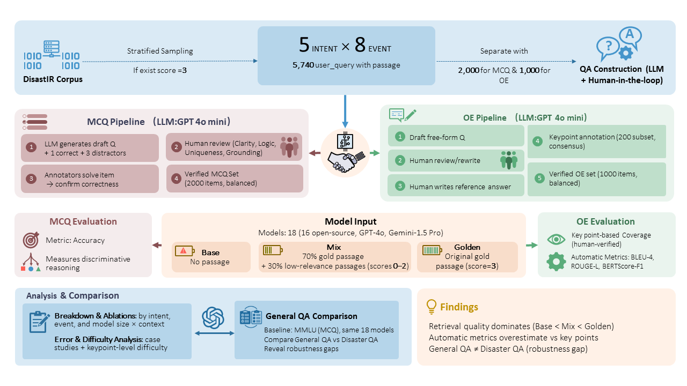

# DisastQA

Accurate question answering (QA) is critical during disasters, yet existing QA benchmarks focus on general or professional domains, leaving disaster contexts critically underexplored. We introduce DisastQA, a large-scale benchmark with 3,000 rigorously verified questions (2,000 Multiple-Choice, 1,000 Open-Ended) spanning diverse and realistic disaster types. DisastQA explicitly models information uncertainty and retrieval dependence—two defining characteristics of real disasters—disentangling model knowledge from evidence use. For Open-Ended QA, we propose a novel keypoint-based evaluation protocol that measures fine-grained factual completeness. Benchmarking 18 models reveals substantial divergences from general-domain leaderboards (e.g., MMLU-Pro) and shows that disaster questions often require reasoning over multiple atomic facts.  These findings highlight the need for retrieval-aware evaluation in high-stakes domains.

  

## 📊 Model Performance on **DisastQA**

Comprehensive evaluation of 18 models under the **Base**, **Mix**, and **Golden** settings.

| Model | Params | **MCQ Accuracy** (Base / Mix / Golden) | **ROUGE-L** (Base / Mix / Golden) | **BLEU-4** (Base / Mix / Golden) | **BERTScore-F1** (Base / Mix / Golden) | **Coverage (%)** (Base / Mix / Golden) |
|--------|---------|---------------------------------------|-----------------------------------|----------------------------------|----------------------------------------|----------------------------------------|
| **GPT-4o** | – | **0.9105 / 0.9625 / 0.9935** | 0.200 / 0.290 / 0.323 | 0.028 / 0.068 / 0.083 | 0.307 / 0.419 / 0.461 | 83.7 / **89.8 / 95.4** |
| **Gemini-1.5 Pro** | – | 0.8895 / 0.9380 / 0.9870 | 0.173 / 0.237 / 0.266 | 0.011 / 0.027 / 0.035 | 0.269 / 0.359 / 0.395 | **84.5** / 84.0 / 95.1 |
| **Qwen-3-8B** | 8.19 B | 0.8865 / **0.9625 / 0.9965** | 0.204 / 0.281 / 0.310 | 0.026 / 0.060 / 0.071 | 0.309 / 0.412 / 0.451 | 79.1 / 87.1 / 93.9 |
| **Yi-6B-Chat** | 6.06 B | 0.8575 / 0.9565 / 0.9930 | 0.228 / 0.286 / 0.318 | 0.047 / 0.081 / 0.101 | 0.329 / 0.412 / 0.449 | 73.1 / 84.7 / 86.5 |
| **Llama-3-8B** | 8.03 B | 0.8715 / 0.9565 / 0.9910 | **0.241 / 0.334 / 0.379** | **0.056 / 0.113 / 0.142** | 0.340 / **0.465 / 0.519** | 77.5 / 85.1 / 93.4 |
| **Qwen-3-4B** | 4.02 B | 0.8605 / 0.9600 / 0.9960 | 0.204 / 0.278 / 0.309 | 0.026 / 0.057 / 0.069 | 0.303 / 0.401 / 0.444 | 76.5 / 83.5 / 91.7 |
| **Qwen-2.5-3B-Instr.** | 3.00 B | 0.8530 / 0.9545 / 0.9915 | 0.207 / 0.282 / 0.313 | 0.027 / 0.061 / 0.074 | 0.309 / 0.402 / 0.444 | 76.9 / 85.4 / 93.4 |
| **Phi-2** | 2.78 B | 0.8725 / 0.9570 / 0.9895 | 0.224 / 0.288 / 0.315 | 0.042 / 0.078 / 0.093 | 0.327 / 0.417 / 0.454 | 74.0 / 82.0 / 86.9 |
| **Mistral-7B-Instr.** | 7.24 B | 0.8180 / 0.9435 / 0.9865 | 0.213 / 0.303 / 0.338 | 0.034 / 0.077 / 0.098 | 0.312 / 0.430 / 0.473 | 76.3 / 85.4 / 91.6 |
| **Gemma-7B** | 8.54 B | 0.8025 / 0.8975 / 0.9805 | 0.230 / **0.350 / 0.420** | 0.050 / **0.134 / 0.171** | 0.323 / 0.459 / 0.544 | 72.9 / 69.7 / 89.7 |
| **DeepSeek-v3-7B** | 7.00 B | 0.8020 / 0.9435 / 0.9860 | 0.241 / 0.340 / 0.379 | 0.053 / 0.118 / 0.143 | **0.342 / 0.460 / 0.508** | 73.5 / 84.1 / 92.0 |
| **Llama-3.2-3B-Instr.** | 3.21 B | 0.8510 / 0.9550 / 0.9865 | 0.241 / 0.333 / 0.371 | 0.053 / 0.110 / 0.133 | 0.339 / 0.458 / **0.508** | 76.6 / 84.3 / 92.0 |
| **Llama-3.2-1B-Instr.** | 1.24 B | 0.8120 / 0.9345 / 0.9690 | 0.226 / 0.300 / 0.331 | 0.044 / 0.092 / 0.110 | 0.329 / 0.437 / 0.483 | 74.5 / 86.5 / 90.4 |
| **Falcon-3-1B-Instr.** | 1.67 B | 0.7475 / 0.9120 / 0.9690 | 0.220 / 0.307 / 0.351 | 0.035 / 0.079 / 0.100 | 0.318 / 0.432 / 0.483 | 71.1 / 84.1 / 92.3 |
| **AceMath-1.5B-Instr.** | 1.78 B | 0.7410 / 0.9210 / 0.9815 | 0.218 / 0.296 / 0.328 | 0.038 / 0.087 / 0.104 | 0.329 / 0.452 / 0.499 | 67.9 / 86.6 / 92.3 |
| **Hunyuan-4B-Instr.** | 4.22 B | 0.8195 / 0.9435 / 0.9780 | 0.165 / 0.221 / 0.241 | 0.016 / 0.037 / 0.047 | 0.265 / 0.360 / 0.391 | 67.2 / 84.5 / 91.4 |
| **Hunyuan-7B-Instr.** | 7.50 B | 0.5700 / 0.8790 / 0.9305 | 0.110 / 0.213 / 0.227 | 0.003 / 0.031 / 0.036 | 0.152 / 0.330 / 0.350 | 39.6 / 72.6 / 79.9 |
| **Qwen-3-0.6B** | 0.75 B | 0.7455 / 0.8290 / 0.8810 | 0.214 / 0.247 / 0.267 | 0.035 / 0.052 / 0.063 | 0.335 / 0.404 / 0.439 | 69.7 / 85.7 / 90.1 |

---

### 🧩 Notes
- **MCQ Accuracy:** Multiple-choice QA performance (Base < Mix < Golden shows strong context dependency).  
- **OE Metrics:** ROUGE-L, BLEU-4, and BERTScore-F1 measure open-ended answer quality.  
- **Coverage:** Reflects factual adequacy and keypoint completeness.  
- This table forms the **main leaderboard** for *DisastQA*, highlighting divergence from general-domain benchmarks (e.g., MMLU-Pro).

---

